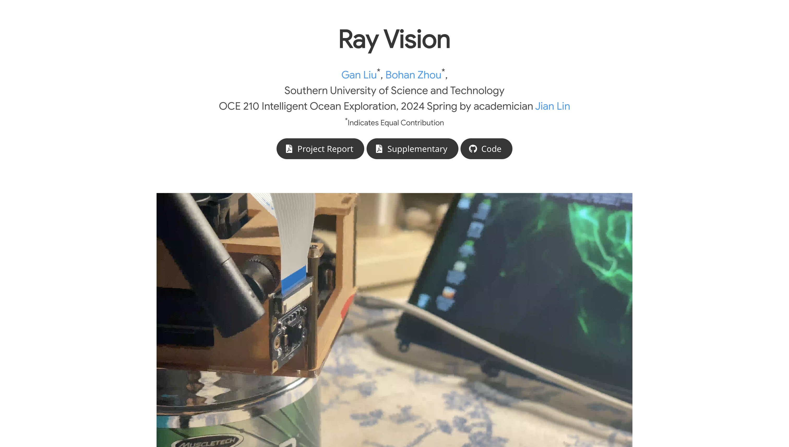

# Ray Vision
Repo for an academic project website page 
This project is conducted as part of the OCE 210 Intelligent Ocean Exploration in the spring of 2024, guided by Professor Jian Lin, who is a Member of the European Academy of Sciences.

## Components
- Teaser video
- Images Carousel
- Youtube embedding
- Video Carousel
- PDF Poster
- Bibtex citation

## Acknowledgments
Parts of this project page were adopted from the [Nerfies](https://nerfies.github.io/) page.

## Website License
 This work is licensed under a <a rel="license" href="http://creativecommons.org/licenses/by-sa/4.0/">Creative Commons Attribution-ShareAlike 4.0 International License</a>.
